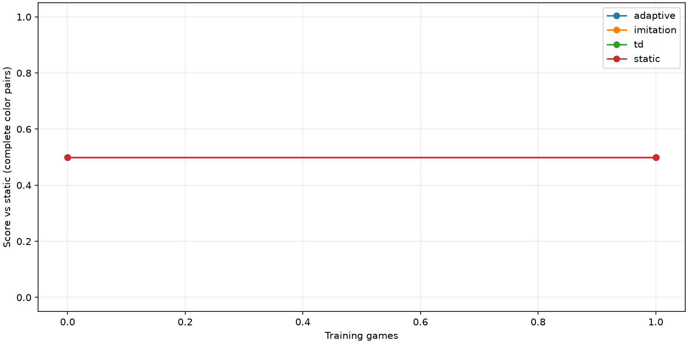

# Badanie AdaptiveChessAI

AI | td: 1/1 | imitation: 1/1 | static: 1/1 | adaptive: 1/1

| Agent | Trening | Pary oceny | Wynik | Przyrost | Przerwane |
|---|---:|---:|---:|---:|---:|
| adaptive | 0 | 3 | 0.5 | 0.0 | 0 |
| adaptive | 1 | 3 | 0.5 | 0.0 | 0 |
| imitation | 0 | 3 | 0.5 | 0.0 | 0 |
| imitation | 1 | 3 | 0.5 | 0.0 | 0 |
| td | 0 | 3 | 0.5 | 0.0 | 0 |
| td | 1 | 3 | 0.5 | 0.0 | 0 |
| static | 0 | 3 | 0.5 | 0.0 | 0 |
| static | 1 | 3 | 0.5 | 0.0 | 0 |

Przedziały 95%: bootstrap parami kolorów w obrębie otwarcia (2000 prób). Mały zbiór otwarć: przedział nie dotyczy populacji graczy.
Krzywa obejmuje pełne pary. Przerwania nie są remisami; liczba przerwań jest raportowana i ogranicza porównanie.

## Ocena przeciw człowiekowi

Brak kontrolnych partii człowieka. Nie ustalono progu przewagi.

Próg operacyjny: minimum 10 gier, wynik >= 60%, dolna granica > 50%. Ocena człowieka: granica Hoeffdinga 95% na pełnych parach kolorów. Wymaga niezależnego bloku potwierdzającego; nie stanowi automatycznego dowodu naukowego przy wielokrotnym sprawdzaniu checkpointów.
